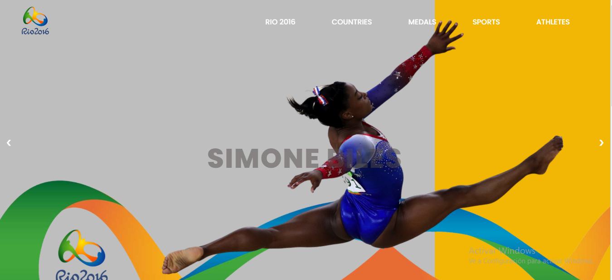
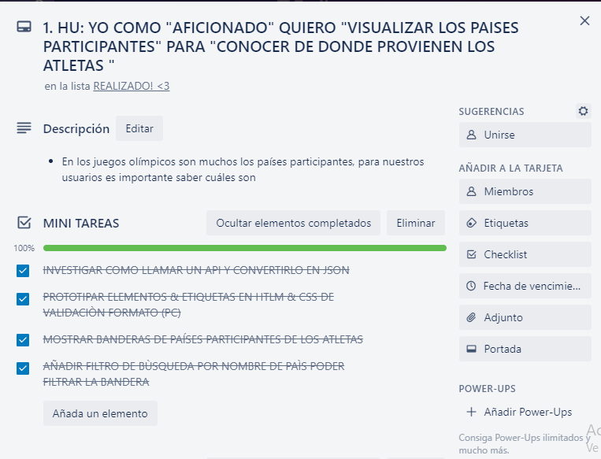
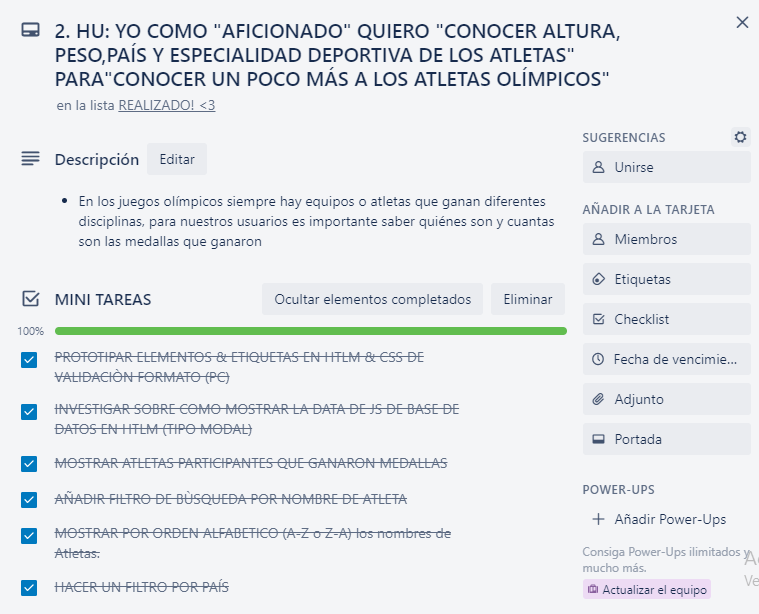
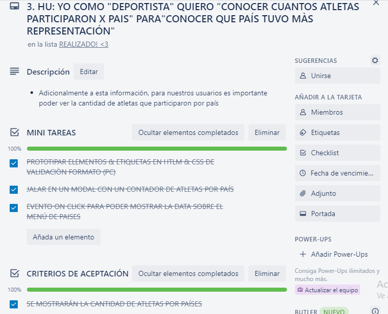
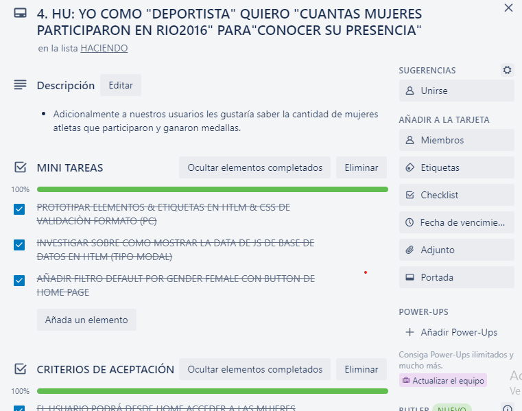
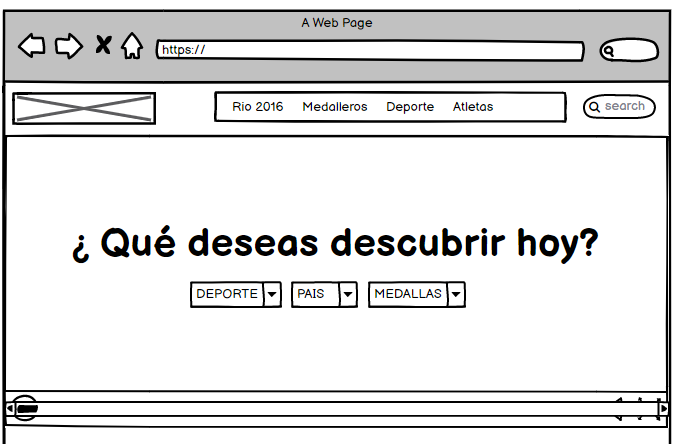
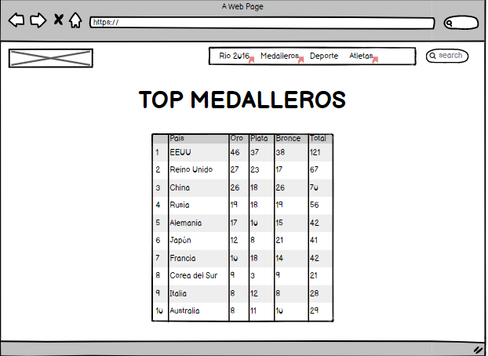
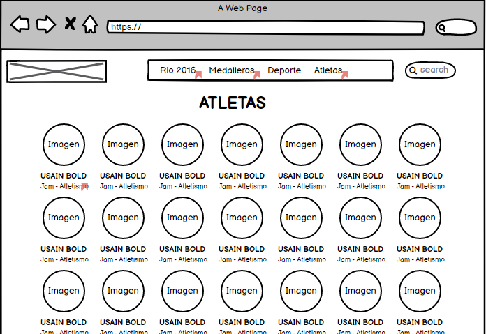
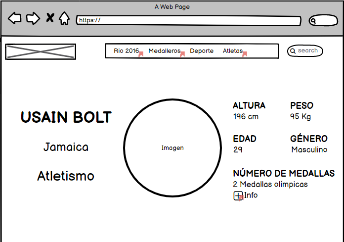
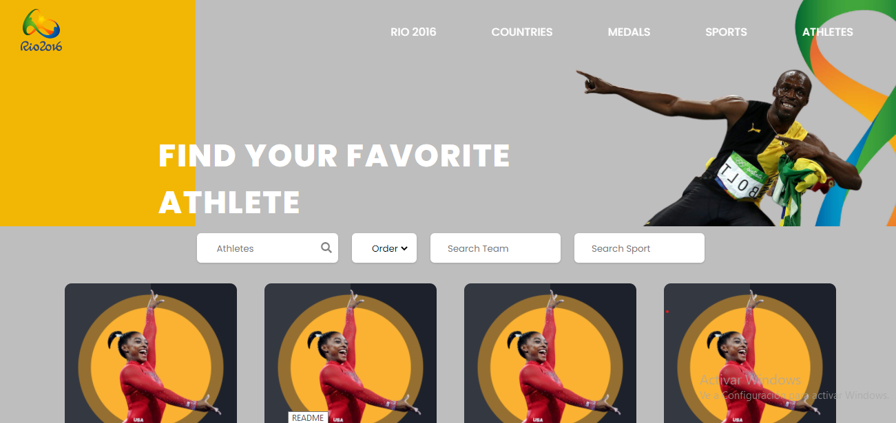

# DATA LOVERS - ATHLETES OLYMPIC RIO 2016

## Índice

* [1. Definición del producto](#1-definición-del-producto)
* [2. Historias de usuario](#2-historias-de-usuario)
* [3. Diseño de la Interfaz de Usuario](#3-diseño-de-la-interfaz-de-usuario)
* [4. Objetivos aprendidos](#4-objetivos-aprendidos)

***

## 1. Definición del producto

Desarrollamos esta página web que tiene cómo  temática las Olimpiadas Rio 2016, mostrando a todos los atletas campeones durante esta competencia hemos procesado la información como los datos de sus países provenientes, medallas que ganaron, deportes y eventos donde compitieron.
 El principal objetivo de la página es poder filtrar y ordenar la data mediante diferentes parámetros (filtrar por nombre, género, países, deporte y evento, ordenar los nombres en forma ascendente o descendente, calcular la cantidad de medallas por país).

### Usuarios del producto
Los usuarios principales de nuestro desarrollo son los aficionados, espectadores amateur  y deportistas élite que acuden a diversos campeonatos, tanto locales como regionales y desean medir los records de los atletas que ganaron durante estas Olimpiadas.

### Objetivos de usuarios en relación al producto
Los aficionados & espectadores amateur buscan conocer más acerca de los atletas que compitieron en las diferentes disciplinas, asi como conocer los países que más campeones tiene y los deportistas buscan analizar las características físicas y record de medallas de los participantes de juegos anteriores para tratar de mejorar estas métricas.

### Proceso de diseño en base a los objetivos de los usuarios
Los hallazgos fueron nuestra guía para diseñar una propuesta interesante para ambos tipos de usuarios, los aficionados y los atletas élite, con los datos más resaltantes de los deportistas campeones desde su ingreso a la página web. También trabajamos con datos más especificos sobre el perfil de cada uno de los atletas campeones de estas olimpiadas a través de tarjetas de perfil del atleta.

Nuestra página está 100% en inglés dado que la data que teníamos era en inglés.

Nuestro proyecto tine 5 subpaginas o secciones:
- *Rio 2016*: La páginade inicio incluímos métricas de fechas, países participantes, atletas en total que participaron, así como más detalles de lo que fueron estas Olimpiadas.
- *Sports*: Aqui desglosamos los sports que se llevaron a cabo durante estas olimpiadas & los eventos por cada disciplina.
- *Atheletes*: Donde brindamos mayor cantidad d filtros sobre nuestros campeones, edad, team, medidas, y medallas por evento.
- *Countries*: Aqui brindamos mayor información sobre los paises que participaron y tuvieron medalleros. Fue la primera vez que participaron refugiados, o sin paìs.
- Top Medalleros: Aqui desglosamos a 10 paises participantes con las mejores métricas. 

## 2. Historias de usuario

Trabajamos con la herramienta trello para esto. 

Nos basamos en 4 historias de usuario, según los hallazgos: 
* 2 de los aficionados al deporte

https://trello.com/c/toJkMoco

* 1 de los deportistas

* 1 de las deportistas mujeres 

## 3. Diseño de la Interfaz de Usuario

### Prototipo de mediana fidelidad

Para hacernos una idea de cómo sería nuestra página, realizamos un bosquejo sencillo que mostraba las dos primeras secciones. Trabajamos con prototipo responsive movil y desktop

https://balsamiq.cloud/sw5bmo9/perzsmn/r2278?f=N4IgUiBcAMA0IDkoEZ4GEXwDKZAIVwFlcAtXAaSgG0BdAXyA]

*VERSION DESKTOP*
, ,
,

*VERSIÓN MOBILE*
https://balsamiq.cloud/slgavje/p329py7/r2278?f=N4IgUiBcCMA0IDkpxAYWfAMhkAhKADPALI4BaOA0lANoC6AvkA%3D%3D

### Prototipo de alta fidelidad

Decidimos utilizar "Figma" para elaborar nuestro prototipo, obteniendo el siguiente resultado: 

### Testeos de usabilidad

Realizamos testeo de nuestro prototipo inicial con un total de 4 personas, obteniendo como retroalimentación de mejoras que implementamos en el producto final, usamos la paleta de colores del logo de las Olimpiadas Río 2016. De hecho, en estos prototipos no incluímos todas las secciones en alta, para optimizar los tiempos, usamos prototipo de media fidelidad para justamente recibir feedback sobre los flujos, realizamos modificaciones y cambios en estilos del modal, home page de acuerdo al feedback que ibamos recibiendo.

## 4. Objetivos aprendidos

### HTML y CSS

* Uso de HTML semántico.
* Uso de selectores de CSS.
* Construir tu aplicación respetando el diseño realizado (maquetación).
* Uso de flexbox en CSS.

### DOM y Web APIs

* Uso de selectores del DOM.
* Manejo de eventos del DOM.
* Manipulación dinámica del DOM (appendChild |createElement | createTextNode| innerHTML | textContent | etc.).

### JavaScript

* Uso de condicionales (if-else | operador ternario)
* Uso de bucles (for)
* Uso de funciones (parámetros | argumentos | valor de retorno)
* Manipular arrays (filter | map | sort)
* Manipular objects (key | value)
* Uso ES modules (`import` | `export`)
* Diferenciar entre expression y statements.
* Diferenciar entre tipos de datos atómicos y estructurados.

### Testing

* Testeo unitario.

### Estructura del código y guía de estilo

* Organizar y dividir el código en módulos (Modularización)
* Uso de identificadores descriptivos (Nomenclatura | Semántica)
* Uso de linter (ESLINT)

### Git y GitHub

* Uso de comandos de git (add | commit | pull | status | push)
* Manejo de repositorios de GitHub (clone | fork | gh-pages)
* Colaboración en Github (branches | pull requests)

### UX

* Diseñar la aplicación pensando y entendiendo al usuario.
* Crear prototipos para obtener feedback e iterar.
* Aplicar los principios de diseño visual (contraste, alineación, jerarquía)
* Planear y ejecutar tests de usabilidad.